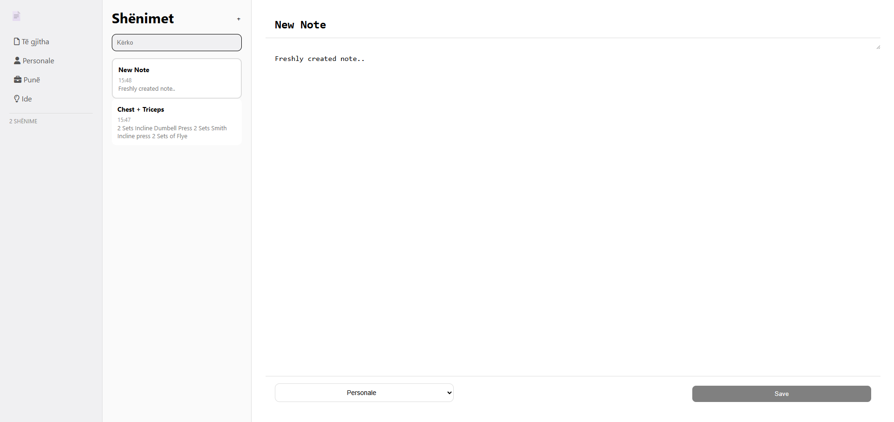

# 📝 Notes App (Flask)

A modern note-taking web application built with Flask and SQLAlchemy.
The app features a clean and minimal UI with sidebar navigation, note list, and a live editor for creating notes.

---

## 🚀 Features

* Create notes
* View notes in a clean interface
* Simple and intuitive layout
* Modern UI design

---

## 🛠️ Tech Stack

* Python (Flask)
* SQLAlchemy (SQLite)
* HTML / CSS

---

## 📂 Project Structure

```
app/
 ├── routes/
 ├── models.py
 ├── extensions.py
 ├── templates/
 └── static/

run.py
config.py
```

---

## ⚙️ Setup

1. Clone the repository:

```
git clone https://github.com/alikrasniqi9/note-taking-app.git
cd note-taking-app
```

2. Create virtual environment:

```
python -m venv .venv
.venv\Scripts\activate   # Windows
```

3. Install dependencies:

```
pip install flask flask-sqlalchemy
```

4. Run the app:

```
python run.py
```

---

## 📌 Future Improvements

* Edit notes
* Delete notes
* Tags & folders
* Dark mode

---

## 👨‍💻 Author

Ali Krasniqi - Piloti
